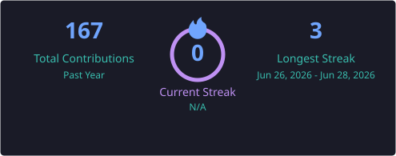

# Hi, I'm Pratik 👋

<h3 align="center">
🚀 Python Developer • AI Developer • Cybersecurity Enthusiast
</h3>

Building intelligent AI systems, cybersecurity tools, and real-world automation projects.

  
  
  

---

# 🚀 About Me

🎓 Final Year BCA Student from India

💻 Passionate about **Python Development, Artificial Intelligence, and Cybersecurity**

🤖 I enjoy building practical AI applications that combine **intelligence, automation, real-time systems, and security**.

🛡️ My primary interests include:

* Artificial Intelligence
* Cybersecurity
* AI Security
* Application Security
* Backend Development
* System Automation
* AI Agents

🎯 **Career Goal**

Become a Cybersecurity Professional specializing in **AI Security** while building intelligent systems that solve real-world problems.

---

# 🧠 What I Build

I focus on building practical software rather than only learning through tutorials.

My projects explore areas such as:

🤖 AI-powered applications and assistants

🛡️ Cybersecurity and threat detection tools

⚡ Automation and intelligent systems

🌐 Full-stack AI applications

🔐 Application and AI security

🎙️ Real-time voice and communication systems

---

# 💻 Technical Skills

## Programming Languages

* Python
* Java
* C
* C++
* JavaScript
* SQL
* HTML
* CSS

---

## Backend Development

* Flask
* REST APIs
* SQLite
* Node.js

---

## AI & Machine Learning

* Google Gemini API
* Generative AI
* AI Agents
* Prompt Engineering
* Machine Learning
* LiveKit

---

## Cybersecurity

* Application Security
* AI Security
* Network Fundamentals
* Threat Intelligence
* Phishing Detection
* Security Automation

---

## Tools & Technologies

* Git
* GitHub
* Docker
* VS Code
* Cursor
* VirtualBox
* XAMPP
* npm
* pnpm
* WebRTC

---

# 🚀 Current Focus

I'm currently focused on:

* 🤖 Building intelligent AI assistants and applications
* 🛡️ Developing cybersecurity tools
* 🔐 Exploring AI Security and Application Security
* ⚡ Improving Python backend development
* 🌐 Building full-stack AI applications
* 🧠 Learning AI Agents and Generative AI
* 📚 Strengthening DSA and Object-Oriented Programming

---

# 📊 GitHub Statistics

  
  

  

---

# 📈 GitHub Activity

I use GitHub to document my development journey, experiment with new technologies, and build projects that help me develop practical engineering and cybersecurity skills.

---

# 📫 Connect With Me

  
  

---

# 💡 Philosophy

> *"I believe the best way to learn is by building. Every project is an opportunity to solve a real problem, explore new technologies, and grow as an engineer."*

---

⭐ **Thanks for visiting my profile!**

